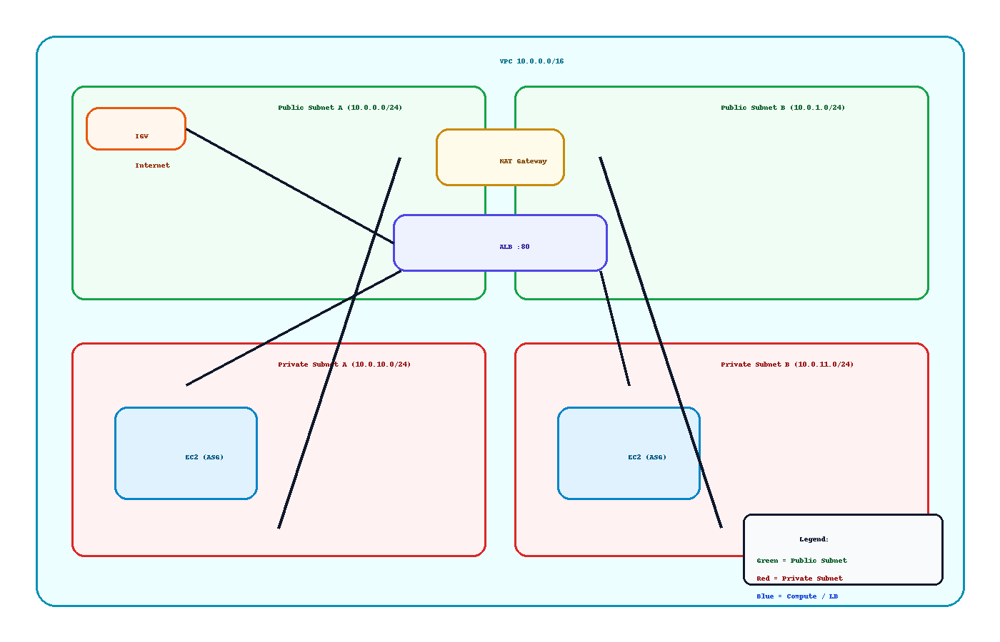

# Tiny 3‑Tier on AWS with Terraform (VPC → ALB → ASG)

[](#)
[](#)
[](#)

A compact, production‑style core that shows real Solutions Architect + DevOps skills.

<p align="center">
  
</p>

## What this deploys
- VPC with **2 public** + **2 private** subnets, IGW, **single NAT** (cost‑aware)
- **Application Load Balancer** (HTTP :80) with health checks on `/health`
- **Auto Scaling Group** (Amazon Linux 2023) bootstrapped by `user_data` running Flask via Gunicorn (port 80)
- **Security Groups**: ALB open to the world on :80; EC2 only allows :80 from ALB SG
- **SSM Parameter Store**: `/tf-mini-3tier/app_message` for a configurable message

## Quick start
```bash
cd terraform
terraform init
terraform apply -auto-approve
terraform output alb_dns_name
# Visit: http://<alb_dns_name>/ and http://<alb_dns_name>/health
```

### Optional: set a custom message
```bash
aws ssm put-parameter   --name /tf-mini-3tier/app_message   --type String --value "Hello from SSM!" --overwrite
```
Scale the ASG to 0 and back to force a refresh, or replace an instance.

## Cost and cleanup
This uses **one NAT Gateway** (~$30–$35/mo prorated). Destroy when you’re done:
```bash
cd terraform
terraform destroy -auto-approve
```

## Repo layout
```
tf-mini-3tier/
├─ app/                  # reference Flask app (also baked by user_data)
├─ terraform/            # all infrastructure (VPC, ALB, ASG, IAM, SSM)
├─ scripts/              # EC2 user_data.sh
├─ docs/                 # architecture diagram, runbooks
└─ .github/workflows/    # CI for fmt/validate/plan (apply via OIDC optional)
```

## CI/CD (optional apply on main with OIDC)
A ready workflow runs **fmt/validate/plan**. To allow **apply on main**:
1. Create an AWS IAM role for GitHub OIDC with repo trust.
2. Add its ARN to `.github/workflows/terraform.yml` (`AWS_ROLE_TO_ASSUME`).
3. Uncomment the **configure-aws-credentials** and **terraform apply** steps.

---

**Author:** jmac052002 • 2025-10-18
